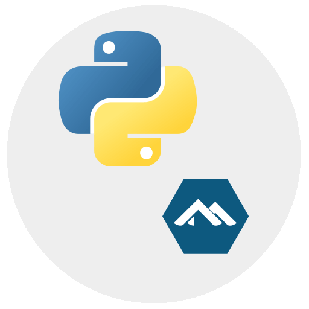

# Alpine Linux 3.5 with Python 3.8.13 on Embassy OS




<details>
<summary>

# Build Instructions

</summary>

<details>
<summary>

### Build enviroment

</summary>
Prepare your EmbassyOS build enviroment. In this example we are using Ubuntu 20.04.

#### Dependencies

- [docker](https://docs.docker.com/get-docker)
- [docker-buildx](https://docs.docker.com/buildx/working-with-buildx/)
- [yq](https://mikefarah.gitbook.io/yq)
- [toml](https://crates.io/crates/toml-cli)
- [appmgr](https://github.com/Start9Labs/embassy-os/tree/master/appmgr)
- [make](https://www.gnu.org/software/make/)


1. Install docker
```
curl -fsSL https://get.docker.com -o- | bash
sudo usermod -aG docker "$USER"
exec sudo su -l $USER
```
2. Set buildx as the default builder
```
docker buildx install
docker buildx create --use
```
3. Enable cross-arch emulated builds in docker
```
docker run --privileged --rm linuxkit/binfmt:v0.8
```
4. Install yq
```
sudo snap install yq
```
5. Install essentials build packages
```
sudo apt-get install -y build-essential openssl libssl-dev libc6-dev clang libclang-dev ca-certificates
```
6. Install Rust
```
curl https://sh.rustup.rs -sSf | sh
# Choose nr 1 (default install)
source $HOME/.cargo/env
```
7. Install toml
```
cargo install toml-cli
```
8. Build and install appmgr
```
cd ~/ && git clone https://github.com/Start9Labs/embassy-os.git
cd embassy-os/appmgr/
cargo install --path=. --features=portable --no-default-features && cd ~/
```
Now you are ready to build your first EmbassyOS service

</details>

### Cloning

Clone the project locally. Note the submodule link to the original project(s). 

```
git clone https://github.com/deanhowe/embassy-moof-python-alpine-wrapper.git
cd embassy-moof-python-alpine-wrapper
```

### Building

To build the project, run the following commands:

```
make
```

However you might want to change a few of the configs first - it is your build after all!

</details>

## Installing (on Embassy)

SSH into an Embassy device.
`scp` the `moof-python-alpine.s9pk` to any directory from your local machine.
Run the following commands to determine successful install:

```

embassy-cli auth login
embassy-cli package install moof-python-alpine.s9pk

```

SSH in and start building.

```

docker exec -it moof-python-alpine sh

```